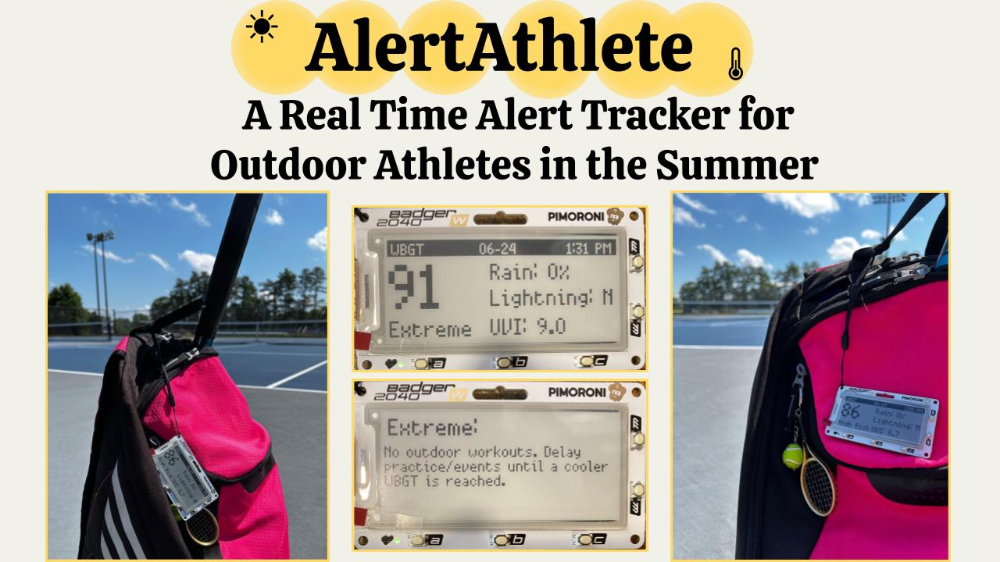

  

This project proposes and implements a mobile device that tracks environmental threats for outdoor athletes in the summer. The proposed device, called AlertAthlete, considers the Wet Bulb Globe Temperature (WBGT), ultraviolet index (UVI), and chance of rain and lightning as the threat indicators. WBGT quantifies the heat stress on the body in direct sunlight and indicates the risk of potential heat stroke. UVI quantifies the intensity of UV radiation, which causes sunburn, and indicates the risk of potential skin cancer. Rain and lightning impact the safety of athletic practice/events. 

AlertAthlete is implemented with a battery-operated RP2040 microcontroller, a batteryless e-ink display, and a real-time clock (RTC). MicroPython code runs through deep sleep cycles with the RTC to periodically download environmental forecasts from the National Oceanic and Atmospheric Administration (NOAA) and OpenWeatherMap. Then, it shows the forecasts and suggested precautions on the e-ink display. AlertAthlete aids athletes to take precautions early for their safety, such as taking breaks in the shades, extra water and sunscreen. 

This project was presented at [PhysTech 2025](https://phystech2025.devpost.com/). 

